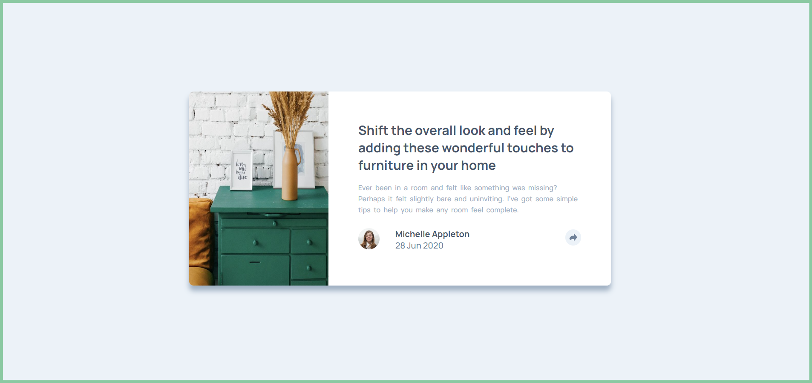

# Frontend Mentor - Article preview component solution

This is a solution to the [Article preview component challenge on Frontend Mentor](https://www.frontendmentor.io/challenges/article-preview-component-dYBN_pYFT). Frontend Mentor challenges help you improve your coding skills by building realistic projects. 

### Screenshot

### Links

- Solution URL: (https://tome-article-preview.netlify.app/)
- Live Site URL: (https://github.com/Tome190/article-preview-component-master)

## My process

### Built with

- Semantic HTML5 markup
- CSS custom properties
- Flexbox
- CSS Grid
- [Sass](sass-lang.com) - For styles
- 
## Author

- Frontend Mentor - (https://www.frontendmentor.io/profile/Grasit)
